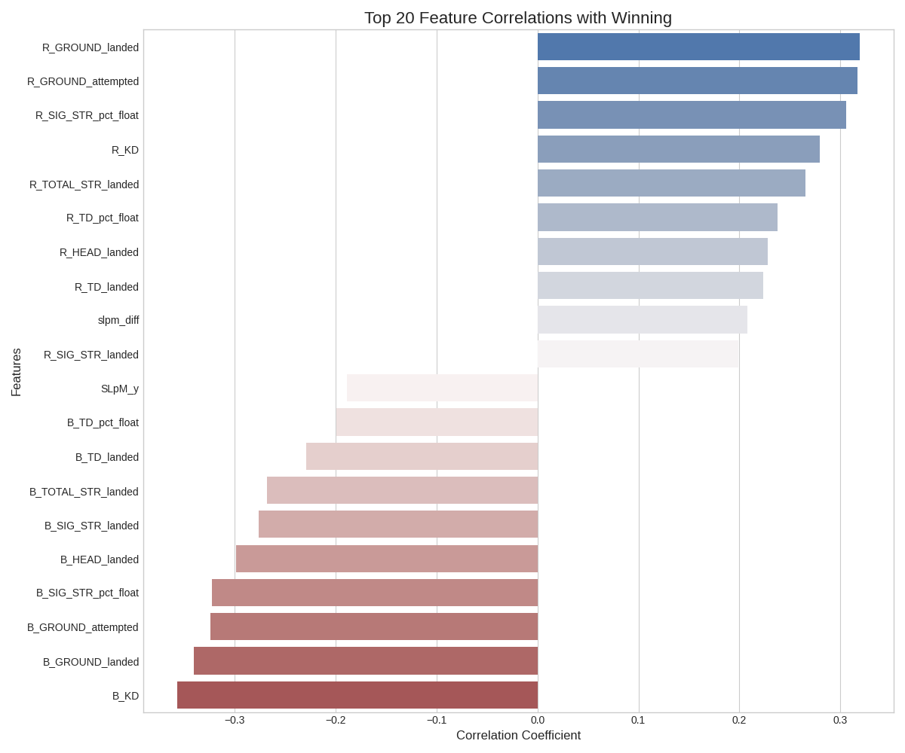
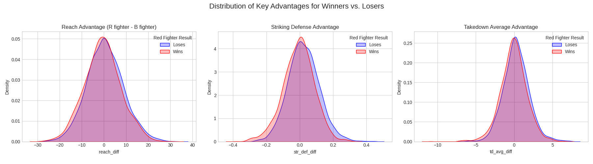

# UFC Winner Prediction System


## Project Overview

This project is a comprehensive machine learning system designed to predict the winners of UFC fights. Leveraging a rich dataset of historical fight and fighter statistics, an XGBoost classification model was developed to forecast outcomes. The process involved extensive data cleaning, robust feature engineering to create meaningful comparative metrics, and model training on a Google Colab TPU. The final model successfully predicts fight winners with **88.41% accuracy** on unseen data.

[cite_start]The initial plan for this project, including ideas for a custom Meta-Elo system and model comparisons[cite: 1], served as a foundational guide for its development.

## Features

-   **Data Processing:** Cleans and processes raw UFC data, handling inconsistent formats, percentages, and missing values.
-   [cite_start]**Feature Engineering:** Creates over 80 numerical features, with a focus on powerful "difference" features (e.g., `reach_diff`, `slpm_diff`, `age_diff`) to directly compare the two opponents in a fight[cite: 1].
-   **XGBoost Model:** A highly-tuned XGBoost classifier that learns from the engineered features to predict the winner.
-   **Model Evaluation:** The model was rigorously evaluated, achieving 88.41% accuracy and demonstrating strong precision and recall for both winning and losing outcomes.
-   **In-depth Analysis:** Includes feature importance and distribution analysis to understand which factors are most predictive of a win.
-   **Prediction Function:** A saved `joblib` model and a prediction script allow for easy predictions on new, hypothetical matchups.

## Key Findings & Results

The model's evaluation shows a high level of performance. The feature analysis provided clear insights into what statistical advantages are most critical in a UFC fight.

#### Top Predictive Factors
The analysis revealed that the most important predictors for winning a fight are advantages in:
-   **Reach (`reach_diff`)**
-   **Striking Defense (`str_def_diff`)**
-   **Takedown Defense (`td_def_diff`)**
-   Conversely, absorbing more strikes than an opponent (`sapm_diff`) is a strong predictor of a loss.



#### Distribution of Advantages
The plots below clearly show that for key metrics like reach and defense, the distribution for winners (blue) is significantly shifted towards having an advantage compared to losers (red).



## Repository Structure

```
UFC-Prediction-System/
│
├── data/
│   ├── raw_fighter_details.csv
│   ├── processed_fight_data.csv
│   └── final_ml_data.csv
│
├── notebooks/
│   └── UFC_Prediction_Analysis.ipynb
│
├── saved_model/
│   └── ufc_winner_predictor_model.joblib
│
├── images/
│   ├── feature_correlations.png
│   ├── feature_distributions.png
│
├── .gitignore
├── LICENSE
└── README.md
```

## How to Use

### 1. Setup
Clone the repository to your local machine:
```bash
git clone [https://github.com/Unpaid-Landlord/UFC-Prediction-System.git](https://github.com/Unpaid-Landlord/UFC-Prediction-System.git)
cd UFC-Prediction-System
```
Ensure you have the required Python libraries:
`pandas`, `xgboost`, `scikit-learn`, `joblib`, `matplotlib`, `seaborn`

### 2. Analysis and Training
The entire workflow, from data cleaning to model training and evaluation, is contained in the Jupyter Notebook:
`notebooks/UFC_Prediction_Analysis.ipynb`

### 3. Making a Prediction
To predict the outcome of a new fight, you can use the saved model and the provided fighter data. A script or function can be created to take two fighter names and return the win probabilities, similar to the example below:
```python
import joblib

# Load the trained model
model = joblib.load('saved_model/ufc_winner_predictor_model.joblib')

# In a full script, you would look up fighter stats and create the feature row
# For example:
# prediction_row = create_prediction_row("Jon Jones", "Stipe Miocic")
# probabilities = model.predict_proba(prediction_row)
```

### Future Improvements

Based on the initial project plan, several exciting enhancements could be made:

-   **Implement a Meta-Elo System:** Develop a custom, dynamic Elo rating system to better capture fighter momentum and quality of opposition.
-   **Model Comparison:** Train and evaluate other models like Random Forest or Logistic Regression to benchmark against the XGBoost performance.
-   **Web Interface:** Deploy the model into a simple web application using a framework like Streamlit for easy, interactive predictions.
-   **Advanced Visualizations:** Create fighter profile radar charts to visually compare opponent stats head-to-head.

## License
This project is licensed under the MIT License. See the `LICENSE` file for details.
